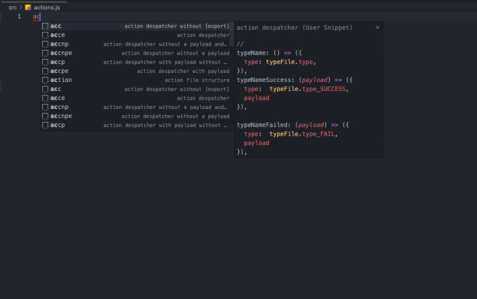
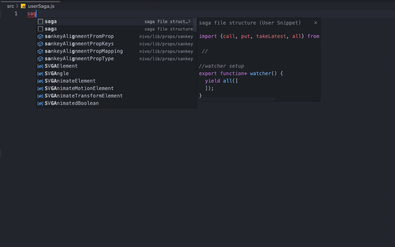
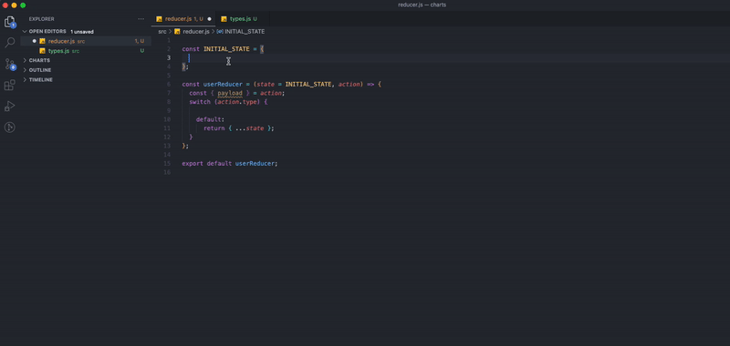

 
# Divine Intellisense for Node js #


Snippets and boilerplate generator for Node, Express, React and Redux


If there is anything that I missed or features you would like this to include. [Let me know](https://github.com/b1n1yam/divine-intellisense-for-nodejs/issues)

*NOTE: This is in early development; however, it does provide a deeper snipet generation than the other Node js and React Intellisense extentions.*

## Features

→ Denotes the `TAB` key.

**Node JS snippets.**

You can easly generate expres routes and controllers for a bulk-CRUD opperation or single functions

### Express Bulk route generator ```erb→```


### Node js Controller Bulk generator ```ncb→```


→ Denotes the `TAB` key.

| Snippet→   | Type  | Output                                                                                                  |
| ---------- | --------   | ------------------------------------------------------------------------------------------------------- |
| `nc→`     | `single`       |  Express single controller                                                                                |
| `ncb→`  | `block`      |  Express Block controller(CRUD)                                                                             |
| `er→`  | `single`      |  single Express route                                                                            |
| `erb→`  | `block`      |  Block Express route (CRUD)                                                                                  |

**React/Redux snippets.**

This extention provides snippets for the most repetitive tasks on redux 


### Redux action dispatcher ```action→``` ```acc→```



### Redux saga  ```saga→``` ```sfc→```



### Redux reduser case  ```redstate→``` ```rcase→```



→ Denotes the `TAB` key.


| Snippet→   | Type  | Output                                                                                                  |
| ---------- | --------   | ------------------------------------------------------------------------------------------------------- |
| `accpe→`  | `block`      |  Action dispatcher block with *payload and export*    
| `acce→`     | `block`       |  Action dispatcher block with export                                                                              |                                                                   |
| `accp→`  | `block`      |  - Action dispatcher with *payload*                                                                         |
| `acc→`  | `block`      |  Action dispatcher *[without export and payload]*                                                                                  |
| `acc→`  | `block`      |  Action dispatcher *[without export]*                                                                                  |
| `accnp→`  | `block`      |  action despatcher *[without a payload and export  ]*                                                                                |
| `accnpe→`  | `block`      |  action despatcher *[without a payload  ]*                                                                                |
| `saga→`  | `single`      |  Saga file structure generator                                                                                |
| `action→`  | `single`      |  Action file structure generator                                                                                |
| `asfcp→`  | `single`      |  saga function with payload                                                                              |
| `sfc→`  | `single`      |  saga function *[without payload ]*                                                                             |
| `redstate→`  | `single`      |  seducer default state                                                                     |
| `rcase→`  | `single`      |  React reducer case generator                                                                   |
| `rtype→`  | `single`      |  React types                                                                   |


 [Code](https://github.com/b1n1yam/divine-intellisense-for-nodejs)
## Contact ##

Telegram: [@b1n1yam](https://t.me/b1n1yam)
Instagram: [@biniyam.daniel](https://www.instagram.com/biniyam.daniel)

[github](https://github.com/b1n1yam/)
